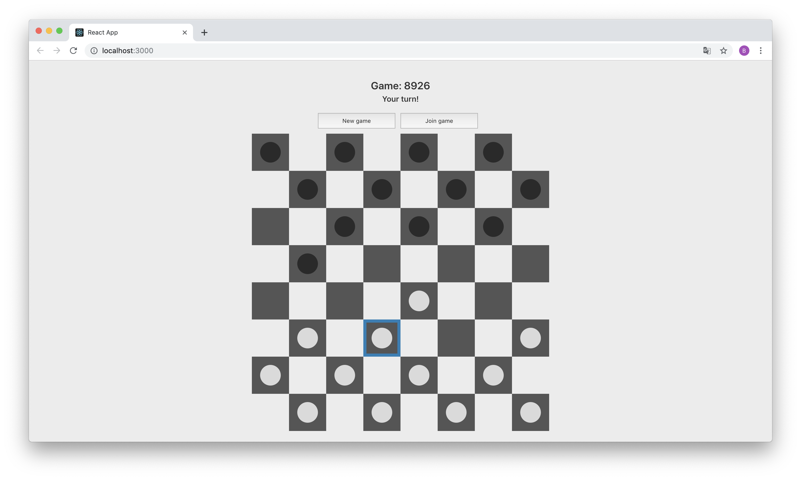

# Checkers Client App

Simple client app developed in ReactJS which uses API served by Checkers Server App.

Before running change your `urlBase` variable in `/src/fetchData.js` to match an IP address and port of your instance of the checkers server.

##### To run:
1. Installing dependencies `npm install`
2. Running app `npm start`

##### Sample screenshots:

